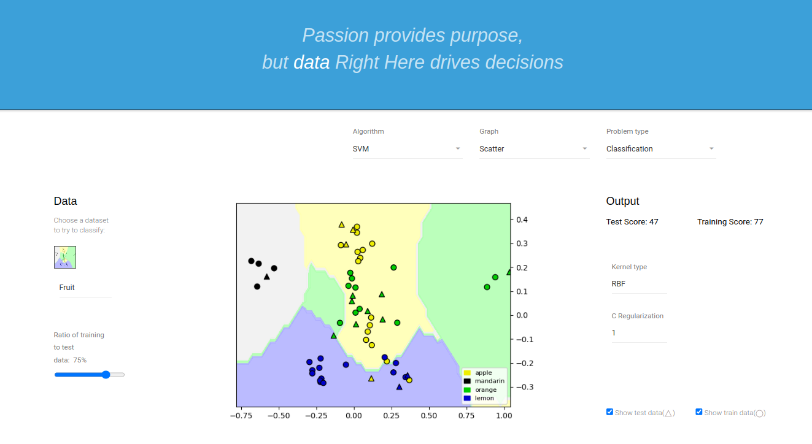

<h1><b>What is Data Dive?<b></h1>

DataDive is a web-based data visualization and predictive modeling playground project. Different resources such as Statiscal approaches, supervised machine learning and python are used to transform and work over the data to get a specified result. The resulting visual representation of data makes it easier to identify trends, outliers, and new insights about the information represented in the data.
 

  

      <h1><b>How to use the site?</b></h1>
      
• <b>Datasets</b> - <b>Fruit:</b>  Solving classification problem with Python using the fruit data with colours The fruits dataset was created by Dr. Iain Murray from University of Edinburgh. He bought a few dozen oranges, lemons and apples of different varieties, and recorded their measurements in a table. And then the we formatted the fruits data slightly.The dataset comprises 150 rows and 7 features. The Python library and the dataset is open for learning purposes.

• <b>Algorithms</b> -SVM: </a> The objective of the support vector machine algorithm is to find a hyperplane(decision boundaries that help classify the data points) in an N-dimensional space(N — the number of features) that distinctly classifies the data points.We find a plane that has the maximum margin, i.e the maximum distance between data points of both classes. Maximizing the margin distance provides some reinforcement so that future data points can be classified with more confidence. Data points falling on either side of the hyperplane can be attributed to different classes. Using these support vectors, we maximize the margin of the classifier. Deleting the support vectors will change the position of the hyperplane. These are the points that help to build SVM.Support Vector Machine we consider for lowering misclassification rate(how much a model misqualifies a data).

• <b>Hyperparameters</b>
- <b>Gaussian Radial Basis Function (RBF):</b> It is one of the most preferred and used kernel functions in svm. It is usually chosen for non-linear data. It helps to make proper separation when there is no prior knowledge of data.

- <b>C Regularization hyperparameter:</b>  
Parameter that controls the trade off between the achieving a low training error and a low testing error that is the ability to generalize your classifier to unseen data

      <h2>What Library Are We Using?</h2>
      

      <a href="https://docs.python.org/3/library/pickle.html" target="blank_"><b>Pickle </b></a> 
      <a href="https://docs.python.org/3/library/urllib.html" target="blank_"><b>Urllib </b></a> 
      <a href="https://docs.python.org/3/library/base64.html" target="blank_"><b>Base64 </b></a> 
      <a href="https://numpy.org/doc/stable/" target="blank_"><b>Numpy </b></a> 
      <a href="https://pandas.pydata.org/docs/" target="blank_"><b>Pandas </b></a> 
      <a href="https://matplotlib.org/stable/index.html" target="blank_"><b>Matplotlib </b></a> 
      <a href="https://seaborn.pydata.org/" target="blank_"><b>Seaborn </b></a> 
      <a href="https://graphviz.org/documentation/" target="blank_"><b>GraphViz </b></a> 
      <a href="https://scikit-learn.org/stable/" target="blank_"><b>Sklearn </b></a>

